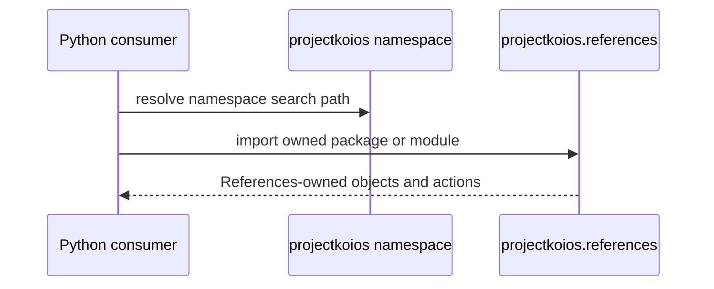

# `projectkoios` namespace implementation

Namespace discovery is configured in [`pyproject.toml`](../../../pyproject.toml).
Importing the namespace grants no reference, citation, scientific, rights, or
publication authority.

- [Namespace index](index.md)
- [Schematic](schematic.md)
