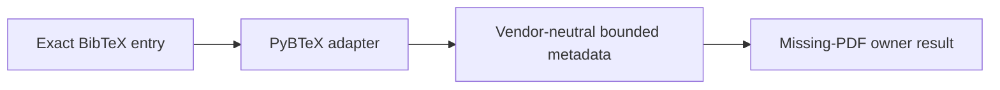

# PyBTeX metadata-reader implementation

The SQLite store depends only on the vendor-neutral
`BibliographyMetadataReader` protocol. This adapter is injected at composition
time and contains the PyBTeX-specific parse boundary.

One parse must yield exactly the declared citekey. The adapter normalizes
multiline display whitespace and constructs a bounded `ReferenceDisplayMetadata`
value. Missing title, author, or year fields remain absent; they are never
inferred. Invalid syntax, mismatched citekeys, and oversized display values fail
closed.

- [Module index](index.md)
- [Schematic](schematic.md)
