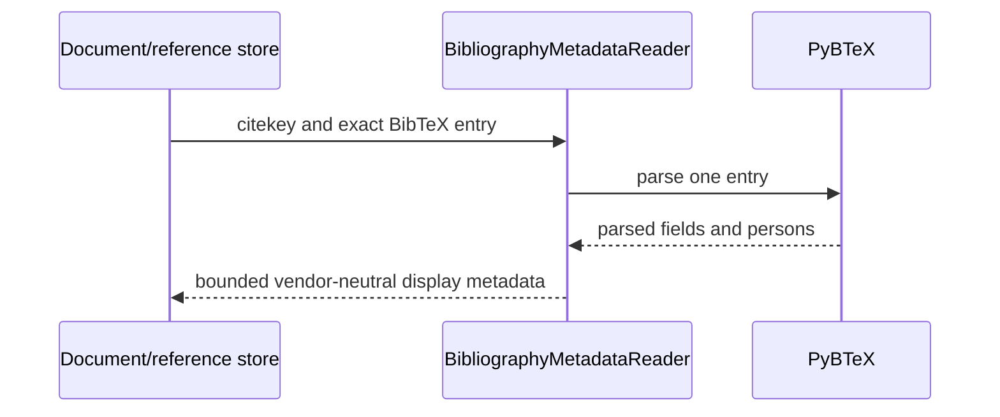

# PyBTeX metadata-reader schematic

```mermaid
sequenceDiagram
    participant S as Document/reference store
    participant R as BibliographyMetadataReader
    participant P as PyBTeX
    S->>R: citekey and exact BibTeX entry
    R->>P: parse one entry
    P-->>R: parsed fields and persons
    R-->>S: bounded vendor-neutral display metadata
```

- [Module index](index.md)
- [Implementation](implementation.md)
