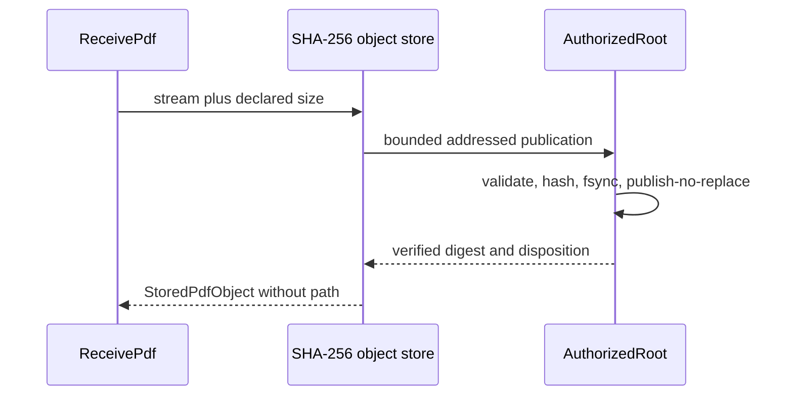

# SHA-256 PDF object store schematic

```mermaid
sequenceDiagram
    participant O as ReceivePdf
    participant F as SHA-256 object store
    participant R as AuthorizedRoot
    O->>F: stream plus declared size
    F->>R: bounded addressed publication
    R->>R: validate, hash, fsync, publish-no-replace
    R-->>F: verified digest and disposition
    F-->>O: StoredPdfObject without path
```

- [Module index](index.md)
- [Implementation](implementation.md)
