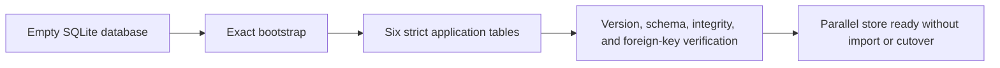

# Document/reference schema implementation

The authoritative module defines `DocumentReferenceSchema.VERSION`, the six
application table names, human-readable rules, bootstrap SQL, and verification
queries. The operational Markdown note is generated from those values rather
than maintained as an independent schema source.

The bootstrap intentionally omits `IF NOT EXISTS`, replacement, migration, and
upsert behavior. `initialize()` accepts only a database with no application
schema objects. `require_supported()` compares the actual schema with a fresh
in-memory execution of the same bootstrap and checks the version; initialization
also checks database and foreign-key integrity.

`documents` identifies bytes by lowercase SHA-256, byte size, and fixed PDF
media type. `document_receipts` records each source-link observation as its own
immutable row, so a later observation cannot overwrite an earlier one.

`reference_records` keeps complete BibTeX entries keyed by citekey.
`reference_collections` keeps collection ID plus source and revision provenance.
`reference_collection_memberships` joins them and declares `required` or
`not-applicable` without any snapshot identity.

`reference_document_bindings` is a neutral relation. Separate unique
constraints on citekey and document digest implement one-to-one binding without
a mutable nullable foreign key. A binding says only that the selected PDF and
reference are linked; it does not accept metadata, rights, scientific support,
or publication state.

Evidence:

- source: [`document_reference_schema.py`](../../../../../../../../src/python/projectkoios/references/adapters/sql/sqlite/document_reference_schema.py)
- tests: [`test__DocumentReferenceSchema.py`](../../../../../../../../tests/test__DocumentReferenceSchema.py)
- generated note: [`document-reference-schema.md`](../../../../../../../document-reference-schema.md)

- [Module index](index.md)
- [Schematic](schematic.md)
