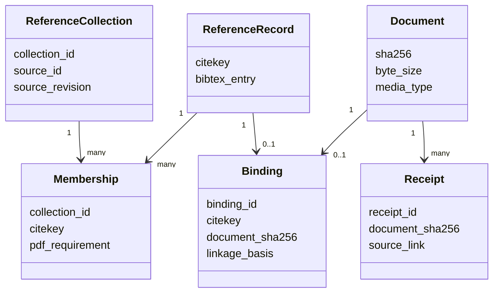

# Document/reference schema schematic

Missing PDFs are not rows. They are required collection memberships for which
no reference/document binding exists.

- [Module index](index.md)
- [Implementation](implementation.md)
