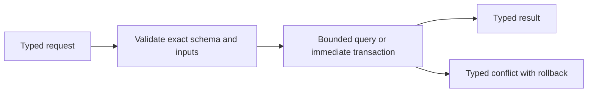

# SQLite document/reference store implementation

The adapter opens a database only below the supplied local `AuthorizedRoot` and
verifies the exact schema before operations. Registration uses exact insert or
exact replay semantics. It never replaces BibTeX, collection provenance, or PDF
requirement. BibTeX parsing is delegated through an injected vendor-neutral
`BibliographyMetadataReader`.

Missing rows are a bounded join over collection membership, requirement, and
binding. Their human display fields come from the injected reader without
exposing raw BibTeX or parser-owned values. PDF receipt records document
identity and an immutable source observation in one database transaction after
byte publication. Binding runs
under `BEGIN IMMEDIATE`; exact retries succeed while citekey or digest reuse
with a different counterpart rolls back as a typed conflict.

- [Module index](index.md)
- [Schematic](schematic.md)
