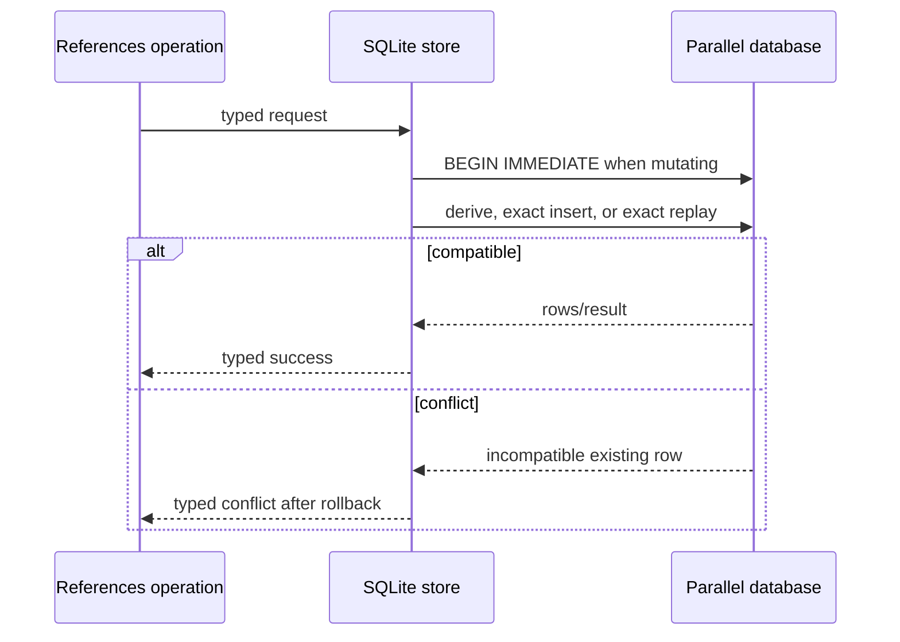

# SQLite document/reference store schematic

```mermaid
sequenceDiagram
    participant O as References operation
    participant S as SQLite store
    participant D as Parallel database
    O->>S: typed request
    S->>D: BEGIN IMMEDIATE when mutating
    S->>D: derive, exact insert, or exact replay
    alt compatible
        D-->>S: rows/result
        S-->>O: typed success
    else conflict
        D-->>S: incompatible existing row
        S-->>O: typed conflict after rollback
    end
```

- [Module index](index.md)
- [Implementation](implementation.md)
