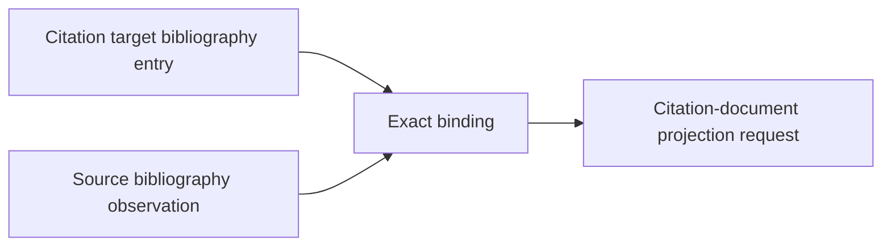

# Bibliography binding implementation

`CitationBibliographyObservationBinding` validates citekey, entry index, source
path, bibliography digest and size, verbatim-entry digest and size, and any
owner-supplied observation identity. The binding is immutable, replay-valid,
and accepted only as its exact canonical type.

`bibliography/resolution.py` performs the sole observation-bound candidate
correlation: only candidates naming the exact bound observation and exact
literal bibliography key are retained.

The package depends on citation base records and existing References identity
evidence. It does not import `citation_document`; projection depends on this
package in the forward direction.

- [Module index](index.md)
- [Schematic](schematic.md)
- source base: [`bibliography/base.py`](../../../../../src/python/projectkoios/references/bibliography/base.py)
- resolution: [`bibliography/resolution.py`](../../../../../src/python/projectkoios/references/bibliography/resolution.py)
