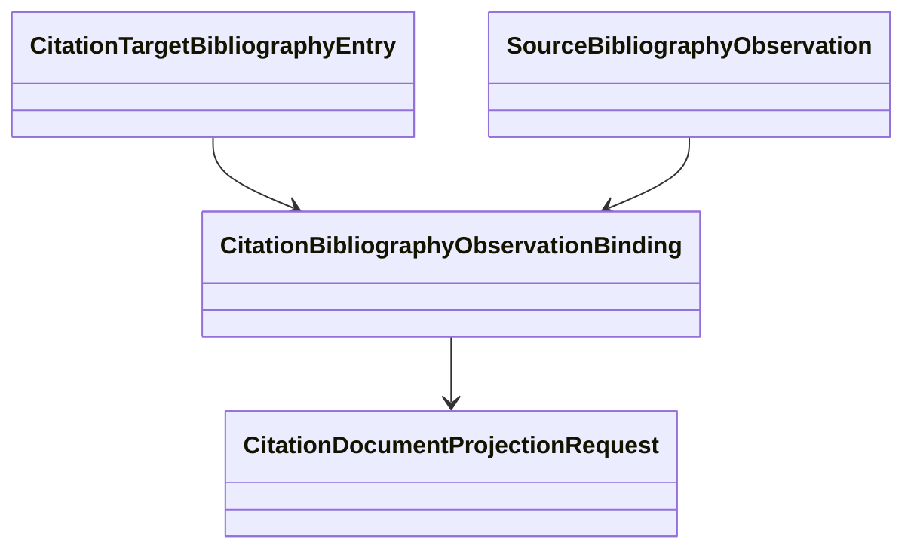

# Bibliography schematic

Membership status remains orthogonal to accepted reference identity and to
source-document availability.

- [Module index](index.md)
- [Implementation](implementation.md)
- [Package index](../index.md)
