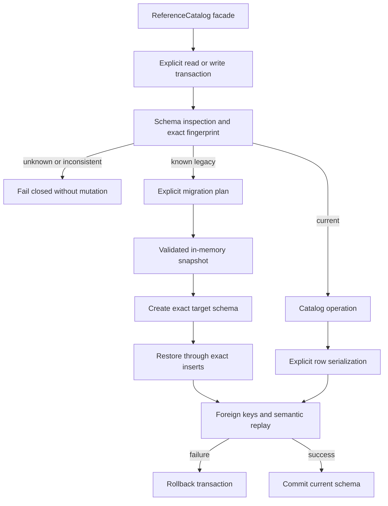

# Catalog implementation

`ReferenceCatalog` remains the sole public orchestration facade. Its package is
partitioned by responsibility without introducing a second catalog abstraction:

- `schema.py` owns normalized SQL, schema fingerprints, schema metadata, known
  legacy layouts, migration plans, and catalog exception types.
- `serialization.py` owns explicit bounded row-value construction for canonical
  immutable records.
- `_replay.py` owns private persisted-row reconstruction and exact semantic
  replay checks.
- `_internals.py` owns private schema inspection, migration snapshot/restore,
  exact inserts, SQLite setup, and path authorization.
- `__init__.py` preserves public imports and owns orchestration, transactions,
  exports, and domain-facing catalog operations.

Migrations remain single `BEGIN IMMEDIATE` transactions. Snapshots are bounded
by the existing source schema and are restored in dependency order. Exact
insert checks reject differing evidence instead of replacing it. Reads rebuild
canonical objects from stored JSON and require exact correspondence with indexed
columns and replay-derived projections.

The schema version remains 5 and `CATALOG_SCHEMA_FINGERPRINT` is still computed
from the same normalized target SQL. Existing current databases and every known
legacy fingerprint continue through the same inspection and migration behavior.

Evidence:

- source: [`catalog`](../../../../../src/python/projectkoios/references/catalog/)
- package compatibility tests: [`test__CatalogPackage.py`](../../../../../tests/test__CatalogPackage.py)
- schema and migration tests: [`test__CatalogSchema.py`](../../../../../tests/test__CatalogSchema.py)
- catalog tests: [`test__ReferenceCatalog.py`](../../../../../tests/test__ReferenceCatalog.py)
- state tests: [`test__StateProjection.py`](../../../../../tests/test__StateProjection.py)

- [Module index](index.md)
- [Schematic](schematic.md)
