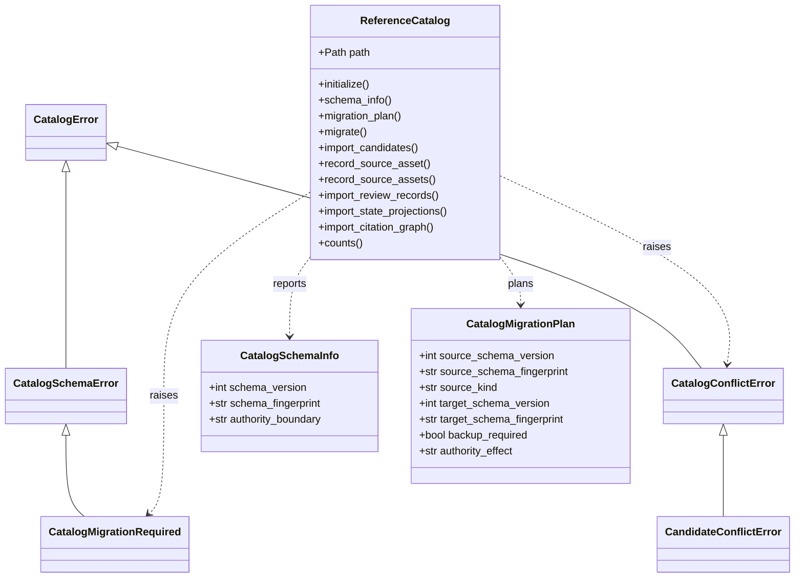

# Catalog schematic

Private implementation bases separate persisted-row replay from schema,
migration, and authorized-path mechanics. They add no public catalog facade and
no alternate authority model.

- [Module index](index.md)
- [Implementation](implementation.md)
