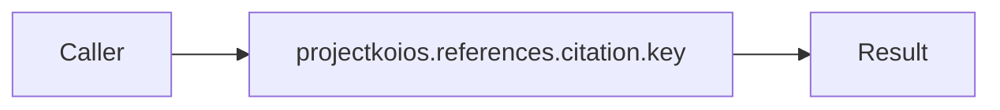

# `projectkoios.references.citation.key` implementation

This package uses direct semantic imports and has no compatibility facade.

```mermaid
flowchart LR
  Caller --> Owner["projectkoios.references.citation.key"]
  Owner --> Result
```

[Back to package](index.md)
