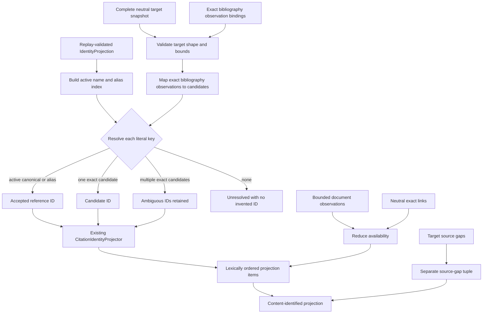

# Citation document control implementation

The canonical package implements two one-path actions.
`CitationDocumentProjector.action` delegates to `project`;
`CitationSourceDocumentLinker.action` delegates to `link`. Focused modules
separate document evidence, projection, linkage, document status, and
contract bounds. Canonical target DTOs come from `citations`; canonical
bibliography bindings come from `bibliography`. The dependency direction is
one-way into `citation_document`.

## Literal-key bridge

Active canonical names and active aliases take precedence over proposed
candidate keys. `bibliography/resolution.py` restricts candidate lookup to
exact `SourceBibliographyObservation` identities bound to exact target
bibliography keys. `citations/resolution.py` applies accepted-name precedence,
retains multiple candidates, and never chooses the first. Identity IDs are
sorted, deduplicated, and processed through the existing bounded
`CitationIdentityProjector` in batches. The document projector composes these
two one-way helpers without duplicating either behavior.

## Document reduction

Document observations contain only opaque document identity, PDF digest, byte
size, media type, evidence identity, coverage, and optional inaccessible
evidence IDs. Complete empty evidence may yield `not-observed` only for a
resolved key. Incomplete or absent evidence yields `not-evaluated`. Positive
single-content evidence yields available-unverified linkage; distinct content
or contradictory accessibility evidence yields ambiguity.

A link request selects one resolved projection item and one exact available
descriptor. Its opaque pre-effect intent is upstream lineage only. The resulting
link binds the prior projection/item, identity projection/item, descriptor,
availability observations, basis, and fixed limitations. Projection requests
consume exact link results rather than bare links. Focused non-recursive
builders provide the sole projection and link behavior paths; each Result
replays its builder and requires exact output equality. Reprojection also
checks that every link remains current before reporting available-linked.
Canonical DTOs, Requests, Results, and actionizers are statically `final`, and
all runtime composition boundaries require exact canonical types. The base
DataObject roles remain available for role classification, not subclass-based
extension of identity-bearing records.

## Identity and bounds

All prototype identities are canonical and unversioned. Request, result,
projection, item, observation, descriptor, imported binding, and link identities are
SHA-256 digests over canonical in-memory payloads. No schema/version field or
version segment is present.

The implementation bounds 10,000 aggregate target records, target source files
(plus the bibliography identity), occurrences, keys, bibliography entries,
source gaps, aggregate source documents, and aggregate inaccessible-evidence
IDs; 256 target
references per record and 256 documents, observations, and
inaccessible-evidence IDs per key; 20,000 links; 100,000,000 bytes per target
source identity or PDF descriptor; 512 UTF-8 bytes per opaque
identity; 4,096 UTF-8 bytes per retained text or relative path; and 20,000,000
UTF-8 bytes per canonical identity payload before hashing. Frozen slotted
dataclasses reject malformed ordering, duplicate identities, correctly
rehashed semantic forgeries, replay drift, stale links, and mismatched
target/bibliography evidence.

## Live target adapter evidence

The privacy-safe compact fixture from replay-valid ksdft owner commit
`3ec21b4318020d700be671a8f220b2149b3d28c7` (tree
`9953c0e99a28443426b5093852292f7cfbada2cc`) adapts without a code dependency.
The only field renames are owner `bibliography_entry_id` to `entry_id` and
`bibliography_path` to `bibliography_source_path`. Owner-only source-file,
include, call, todo, request, and result records are not copied. The fixture
covers all three origin values, nullable fields, owner ordering, exact IDs,
shared bounds, the exact `[A-Za-z0-9._-]{1,200}` literal-key grammar, and
normalized relative POSIX source paths without filesystem mutation policy; its
SHA-256 is
`d0019af4bcd5d3331c5ffc499bb95838215f09cc7d54b61d45b72456ed3db70d`.

The facade retains deprecated attributes for moved citation and bibliography
names. Each resolves to the exact canonical object and emits at most one
`DeprecationWarning` per name in one process; no wrapper, subclass, alternate
payload, or duplicate identity is introduced.

Evidence:

- source facade: [`citation_document/__init__.py`](../../../../../src/python/projectkoios/references/citation_document/__init__.py)
- projection: [`projection.py`](../../../../../src/python/projectkoios/references/citation_document/projection.py)
- citation resolution: [`citations/resolution.py`](../../../../../src/python/projectkoios/references/citations/resolution.py)
- bibliography resolution: [`bibliography/resolution.py`](../../../../../src/python/projectkoios/references/bibliography/resolution.py)
- linkage: [`linkage.py`](../../../../../src/python/projectkoios/references/citation_document/linkage.py)
- focused tests: [`test__CitationDocumentProjection.py`](../../../../../tests/test__CitationDocumentProjection.py)
- live adapter test: [`test__CitationDocumentTargetAdapter.py`](../../../../../tests/test__CitationDocumentTargetAdapter.py)
- compatibility test: [`test__CitationCompatibilityFacade.py`](../../../../../tests/test__CitationCompatibilityFacade.py)
- owner fixture: [`ksdft-3ec21b4-compact-result.json`](../../../../../tests/fixtures/citation_document/ksdft-3ec21b4-compact-result.json)
- contract: [`citation-document.md`](../../../../contracts/citation-document.md)

- [Module index](index.md)
- [Schematic](schematic.md)
