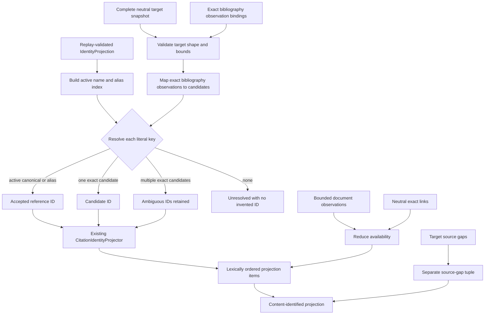

# Citation document control implementation

The module implements two one-path actions. `CitationDocumentProjector.action`
delegates to `project`; `CitationSourceDocumentLinker.action` delegates to
`link`.

## Literal-key bridge

Active canonical names and active aliases take precedence over proposed
candidate keys. Otherwise candidate lookup is restricted to exact
`SourceBibliographyObservation` identities bound to target bibliography
entries. Multiple candidates are projected together; the implementation never
chooses the first. Identity IDs are sorted, deduplicated, and processed through
the existing bounded `CitationIdentityProjector` in batches.

## Document reduction

Document observations contain only opaque document identity, PDF digest, byte
size, media type, evidence identity, coverage, and optional inaccessible
evidence IDs. Complete empty evidence may yield `not-observed` only for a
resolved key. Incomplete or absent evidence yields `not-evaluated`. Positive
single-content evidence yields available-unverified linkage; distinct content
or contradictory accessibility evidence yields ambiguity.

A link request selects one resolved projection item and one exact available
descriptor. Its opaque pre-effect intent is upstream lineage only. The resulting
link binds the prior projection/item, identity projection/item, descriptor,
availability observations, basis, and fixed limitations. Reprojection checks
that every link is current and exact before reporting available-linked.

## Identity and bounds

All prototype identities are canonical and unversioned. Request, result,
projection, item, observation, descriptor, binding, and link identities are
SHA-256 digests over canonical in-memory payloads. No schema/version field or
version segment is present.

The implementation bounds 10,000 occurrences, keys, bibliography entries,
source gaps, and aggregate source documents; 256 documents per key; 20,000
links; 512 UTF-8 bytes per opaque identity; and 4,096 UTF-8 bytes per retained
text or relative path. Frozen slotted dataclasses reject malformed ordering,
duplicate identities, forged content IDs, replay drift, stale links, and
mismatched target/bibliography evidence.

Evidence:

- source: [`citation_document.py`](../../../../../src/python/projectkoios/references/citation_document.py)
- focused tests: [`test__CitationDocumentProjection.py`](../../../../../tests/test__CitationDocumentProjection.py)
- contract: [`citation-document.md`](../../../../contracts/citation-document.md)

- [Module index](index.md)
- [Schematic](schematic.md)
