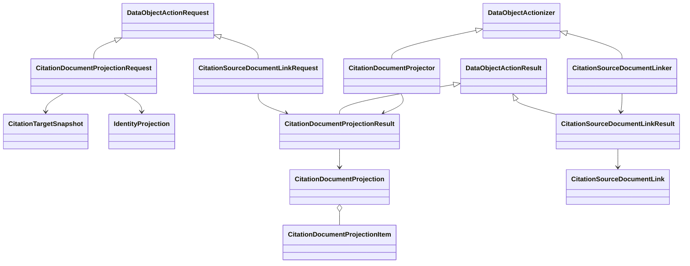

# Citation document control schematic

The target snapshot and identity replay enter from their owners. The projection
is rebuilt after a neutral link is created; no mutable attachment row or
last-write-wins state exists.

- [Module index](index.md)
- [Implementation](implementation.md)
