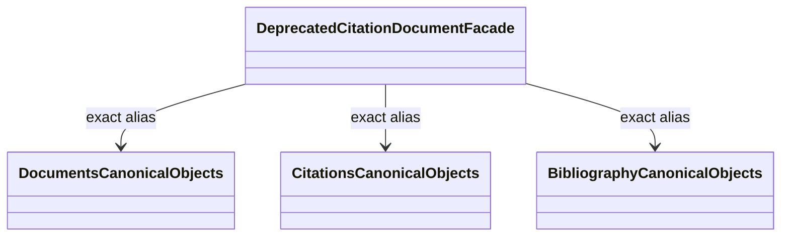

# Deprecated citation-document namespace schematic

```mermaid
classDiagram
    class DeprecatedCitationDocumentFacade
    class DocumentsCanonicalObjects
    class CitationsCanonicalObjects
    class BibliographyCanonicalObjects
    DeprecatedCitationDocumentFacade --> DocumentsCanonicalObjects : exact alias
    DeprecatedCitationDocumentFacade --> CitationsCanonicalObjects : exact alias
    DeprecatedCitationDocumentFacade --> BibliographyCanonicalObjects : exact alias
```

The arrows denote Python object identity, not conversion or wrapping.

- [Module index](index.md)
- [Implementation](implementation.md)
