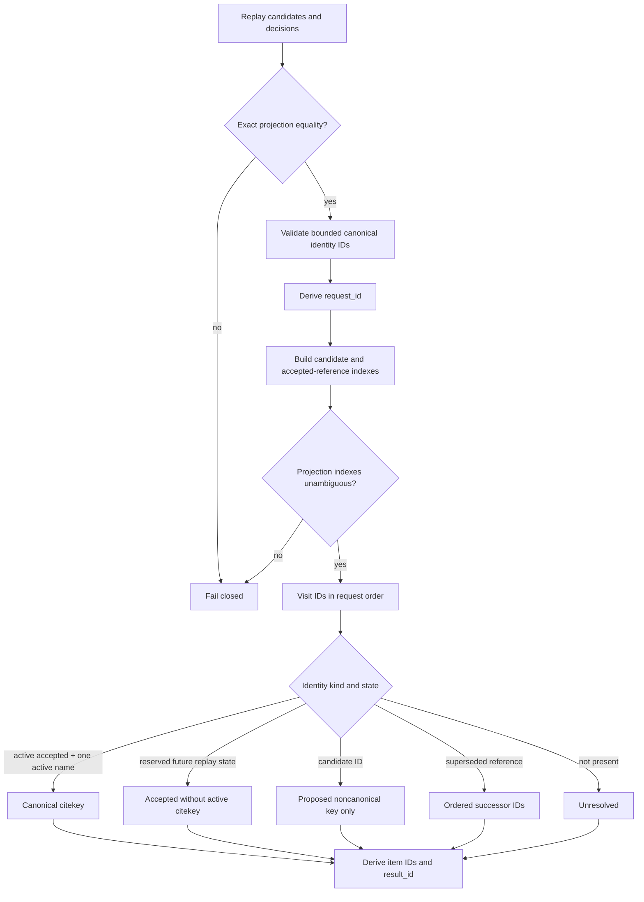

# Citation identity projection implementation

The request accepts one replay-derived `IdentityProjection` and a nonempty,
unique, lexically sorted tuple of at most 1,024 opaque identity IDs. It rejects
more than 512 code points before UTF-8 encoding, then enforces the 512-byte,
trim, and control-character bounds. Sorting makes request and item ordering
canonical while each item retains the exact requested ID.

Request construction replays the projection's candidate and decision inputs and
requires exact equality with every supplied derived field before binding the
`projection_id`. Under the current owner replay, every active accepted identity
has one active citekey and every inactive accepted identity has supersession;
accepted-without-active-citekey is therefore reserved and not emitted today.

`action(*, request)` delegates directly to `project(*, request)`. Before
projection, the performer also rejects duplicate candidate/reference identities,
identity-kind overlap, unknown active references, multiple active citekeys,
active names on inactive references, duplicate supersessions, unknown
supersession endpoints, and active references also marked superseded.

Request, item, and result IDs are SHA-256 digests of canonical JSON assembled
in memory. They are object identities, not a serialization schema or wire
contract. The result validates positional request/item correlation and repeats
the input `projection_id` without altering the identity projection.

Evidence:

- source: [`citation_identity.py`](../../../../../src/python/projectkoios/references/citation_identity.py)
- synthetic tests: [`test__CitationIdentityProjection.py`](../../../../../tests/test__CitationIdentityProjection.py)

- [Module index](index.md)
- [Schematic](schematic.md)
