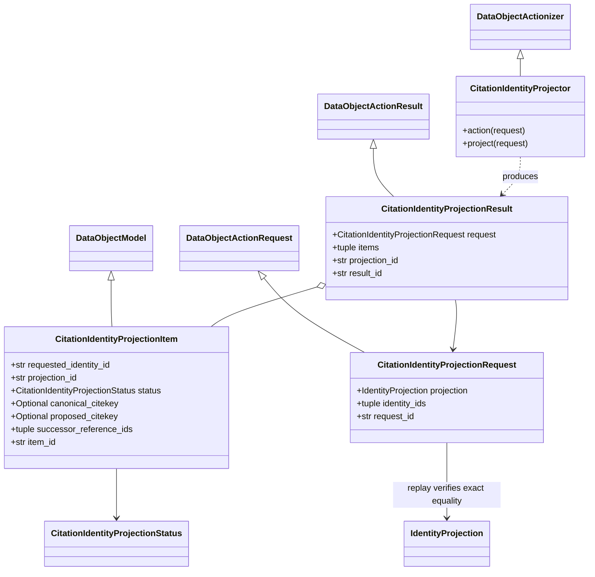

# Citation identity projection schematic

```mermaid
classDiagram
    class DataObjectActionRequest
    class DataObjectModel
    class DataObjectActionResult
    class DataObjectActionizer
    class IdentityProjection
    class CitationIdentityProjectionStatus
    class CitationIdentityProjectionRequest {
        +IdentityProjection projection
        +tuple identity_ids
        +str request_id
    }
    class CitationIdentityProjectionItem {
        +str requested_identity_id
        +str projection_id
        +CitationIdentityProjectionStatus status
        +Optional canonical_citekey
        +Optional proposed_citekey
        +tuple successor_reference_ids
        +str item_id
    }
    class CitationIdentityProjectionResult {
        +CitationIdentityProjectionRequest request
        +tuple items
        +str projection_id
        +str result_id
    }
    class CitationIdentityProjector {
        +action(request)
        +project(request)
    }
    DataObjectActionRequest <|-- CitationIdentityProjectionRequest
    CitationIdentityProjectionRequest --> IdentityProjection : replay verifies exact equality
    DataObjectModel <|-- CitationIdentityProjectionItem
    DataObjectActionResult <|-- CitationIdentityProjectionResult
    DataObjectActionizer <|-- CitationIdentityProjector
    CitationIdentityProjectionItem --> CitationIdentityProjectionStatus
    CitationIdentityProjectionResult o-- CitationIdentityProjectionItem
    CitationIdentityProjectionResult --> CitationIdentityProjectionRequest
    CitationIdentityProjector ..> CitationIdentityProjectionResult : produces
```

- [Module index](index.md)
- [Implementation](implementation.md)
