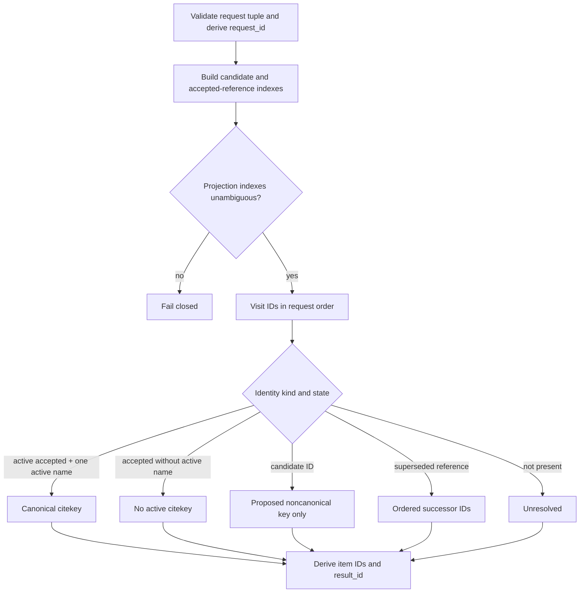

# Citation identity projection implementation

The request accepts one replay-derived `IdentityProjection` and a nonempty,
unique, lexically sorted tuple of at most 1,024 opaque identity IDs. Each ID is
trimmed, control-free UTF-8 of at most 512 bytes. Sorting makes request and item
ordering canonical while each item retains the exact requested ID.

`action(*, request)` delegates directly to `project(*, request)`. Before
projection, the performer rejects duplicate candidate/reference identities,
identity-kind overlap, unknown active references, multiple active citekeys,
active names on inactive references, duplicate supersessions, unknown
supersession endpoints, and active references also marked superseded.

Request, item, and result IDs are SHA-256 digests of canonical JSON assembled
in memory. They are object identities, not a serialization schema or wire
contract. The result validates positional request/item correlation and repeats
the input `projection_id` without altering the identity projection.

Evidence:

- source: [`citation_identity_projection.py`](../../../../../src/python/projectkoios/references/citation_identity_projection.py)
- synthetic tests: [`test__CitationIdentityProjection.py`](../../../../../tests/test__CitationIdentityProjection.py)

- [Module index](index.md)
- [Schematic](schematic.md)
