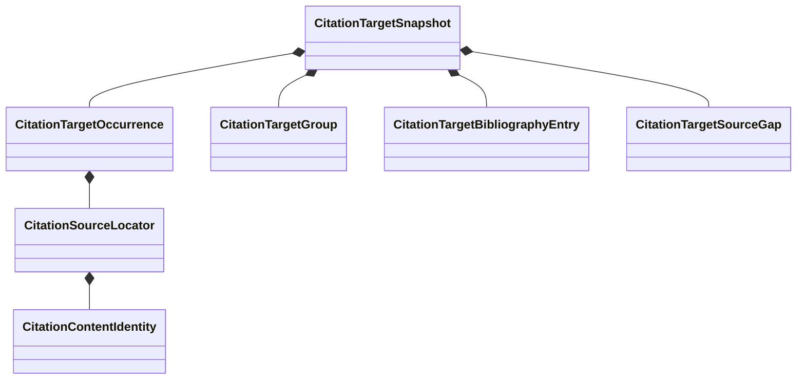

# Citation inventory schematic

The snapshot is a complete bounded neutral copy of target-owned citation state.
It owns neither bibliography observations nor source-document availability.

- [Module index](index.md)
- [Implementation](implementation.md)
- [Package index](../index.md)
