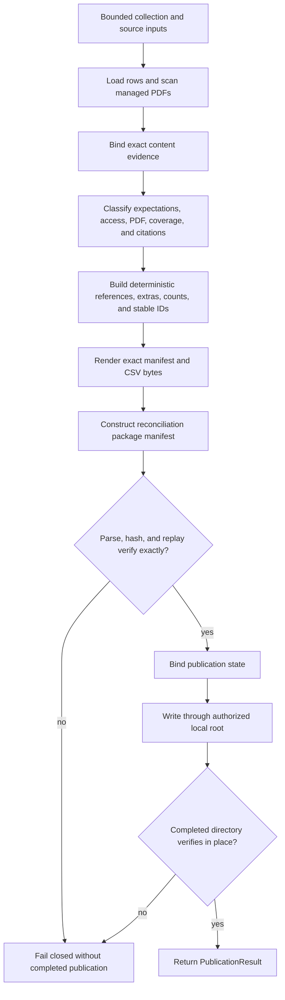

# Collection reconciliation implementation

The package preserves one public contract while separating responsibilities:

- `_contract.py` owns private schema, processor, parser, bound, and stable-ID
  constants and helpers.
- `models.py` owns immutable evidence, status, manifest, output, and publication
  value objects.
- `loading.py` owns bounded collection-row parsing, managed-PDF scanning, and
  source-discovery parsing.
- `evidence.py` owns exact input-evidence binding, retention, and evidence
  projection helpers.
- `classification.py` owns PDF, access, expectation, coverage, and count
  reductions.
- `rendering.py` owns deterministic JSON/CSV output bytes.
- `reconciliation.py` owns the sole core reconciliation orchestration path.
- `publication.py` owns package verification, binding, publication, parsing,
  verification, and replay.
- `__init__.py` preserves the public import facade by re-exporting the exact
  implementation objects without wrappers or duplicate models.

Every input collection retains exact `ContentEvidence`; duplicate or conflicting
content identities fail closed. Stable IDs remain SHA-256 digests of the same
canonical JSON payloads. Ordering, counts, classification precedence, nullable
fields, and rendered bytes are unchanged.

Publication retains the existing completion protocol: pre-existing incomplete
or inconsistent output directories are rejected, files are checked against the
package manifest, and replay must produce exact output equality before a
publication result is returned. The package grants no additional authority.

Evidence:

- source: [`collection_reconciliation`](../../../../../src/python/projectkoios/references/collection_reconciliation/)
- package compatibility tests: [`test__CollectionReconciliationPackage.py`](../../../../../tests/test__CollectionReconciliationPackage.py)
- reconciliation tests: [`test__CollectionReconciliation.py`](../../../../../tests/test__CollectionReconciliation.py)
- package tests: [`test__ReconciliationPackage.py`](../../../../../tests/test__ReconciliationPackage.py)

- [Module index](index.md)
- [Schematic](schematic.md)
