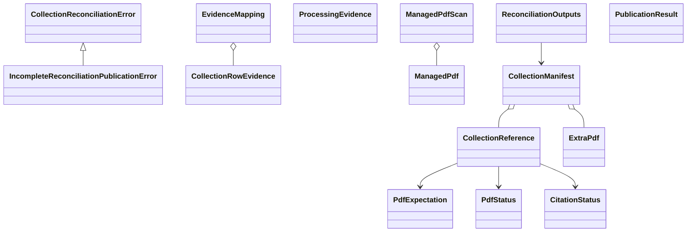

# Collection reconciliation schematic

Public functions load bounded evidence, reconcile it once, render deterministic
outputs, and publish only an exactly verified package. Private modules add no
parallel contracts or alternate publication path.

- [Module index](index.md)
- [Implementation](implementation.md)
