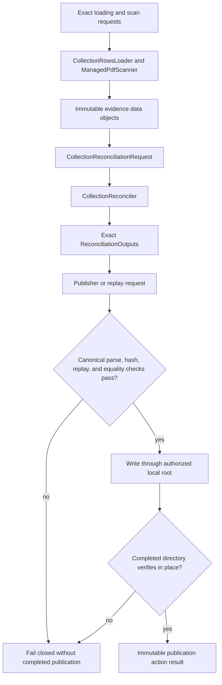

# Collection reconciliation implementation

The canonical package owns explicit Project Koios action families rather than
free operational functions:

- `loading.py` owns `CollectionRowsLoader` and `ManagedPdfScanner`, with one
  exact immutable request/result pair and their loaded evidence data objects.
- `evidence.py` owns processing-evidence adaptation and exact input-evidence
  binding.
- `classification.py` owns reconciliation statuses and classified reference
  and extra-PDF data objects.
- `manifest.py` owns the collection manifest and exact output bundle.
- `reconciliation.py` owns `CollectionReconciler` and its request/result pair.
- `publication.py` owns the publication data object plus publisher, parser,
  verifier, and replayer actionizers, each with a distinct request/result pair.
- `errors.py` owns the shared fail-closed error boundary.
- `rendering.py` implements deterministic format-specific rendering without
  introducing an alternate public action contract.
- `_contract.py` owns private schema, processor, parser, bound, and stable-ID
  constants.
- `__init__.py` is deliberately empty apart from its package description; it is
  not an API aggregation layer.

All canonical requests, results, and data objects are immutable and reject
subtype substitution where identity-bearing behavior depends on exact runtime
types. Actionizers expose only `action`; behavior is not hidden in private
static/class-method utility containers. Stable IDs remain SHA-256 digests of
the same canonical JSON payloads. Ordering, counts, nullable fields,
classification precedence, resource bounds, and rendered bytes remain part of
the contract.

Publication retains the completion protocol: pre-existing incomplete or
inconsistent output directories are rejected, files are checked against the
package manifest, and replay must produce exact output equality before a
publication result is returned. None of these actions grants additional
identity, rights, review, ingestion, processing, Search, use, or publication
authority.

Evidence:

- [canonical source package](../../../../../../src/python/projectkoios/references/collections/reconciliation/)
- [mirrored action tests](../../../../../../tests/package/projectkoios/references/collections/reconciliation/)
- [module index](index.md)
- [schematic](schematic.md)
