# Collection reconciliation schematic

```mermaid
classDiagram
    class DataObjectModel
    class DataObjectActionRequest
    class DataObjectActionResult
    class DataObjectActionizer
    class CollectionRowsLoadRequest
    class CollectionRowsLoadResult
    class CollectionRowsLoader
    class ManagedPdfScanRequest
    class ManagedPdfScanResult
    class ManagedPdfScanner
    class CollectionReconciliationRequest
    class CollectionReconciliationResult
    class CollectionReconciler
    class ReconciliationPublicationRequest
    class ReconciliationPublicationResult
    class ReconciliationPublisher
    class ReconciliationPackageParseRequest
    class ReconciliationPackageParseResult
    class ReconciliationPackageParser
    class ReconciliationPackageVerificationRequest
    class ReconciliationPackageVerificationResult
    class ReconciliationPackageVerifier
    class ReconciliationReplayRequest
    class ReconciliationReplayResult
    class ReconciliationReplayer

    DataObjectActionRequest <|-- CollectionRowsLoadRequest
    DataObjectActionResult <|-- CollectionRowsLoadResult
    DataObjectActionizer <|-- CollectionRowsLoader
    DataObjectActionRequest <|-- ManagedPdfScanRequest
    DataObjectActionResult <|-- ManagedPdfScanResult
    DataObjectActionizer <|-- ManagedPdfScanner
    DataObjectActionRequest <|-- CollectionReconciliationRequest
    DataObjectActionResult <|-- CollectionReconciliationResult
    DataObjectActionizer <|-- CollectionReconciler
    DataObjectActionRequest <|-- ReconciliationPublicationRequest
    DataObjectActionResult <|-- ReconciliationPublicationResult
    DataObjectActionizer <|-- ReconciliationPublisher
    DataObjectActionRequest <|-- ReconciliationPackageParseRequest
    DataObjectActionResult <|-- ReconciliationPackageParseResult
    DataObjectActionizer <|-- ReconciliationPackageParser
    DataObjectActionRequest <|-- ReconciliationPackageVerificationRequest
    DataObjectActionResult <|-- ReconciliationPackageVerificationResult
    DataObjectActionizer <|-- ReconciliationPackageVerifier
    DataObjectActionRequest <|-- ReconciliationReplayRequest
    DataObjectActionResult <|-- ReconciliationReplayResult
    DataObjectActionizer <|-- ReconciliationReplayer
```

Each action family has one owner module and one public `action` entry point.
Exact request/result types keep loading, scanning, reconciliation, publication,
parsing, verification, and replay boundaries distinct. Immutable domain records
remain `DataObjectModel` values, while private responsibility modules add no
parallel public contracts.

- [Module index](index.md)
- [Implementation](implementation.md)
