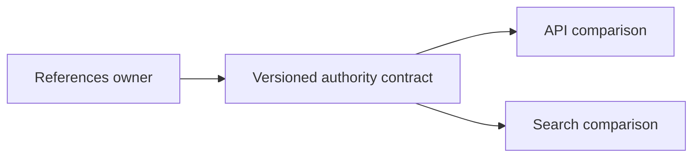

# courses.authority.contract: schematics

```mermaid
flowchart LR
    References[References owner] --> Contract[Versioned authority contract]
    Contract --> API[API comparison]
    Contract --> Search[Search comparison]
```

The identity is owner-minted and transported without reinterpretation.

- [Overview](index.md)
