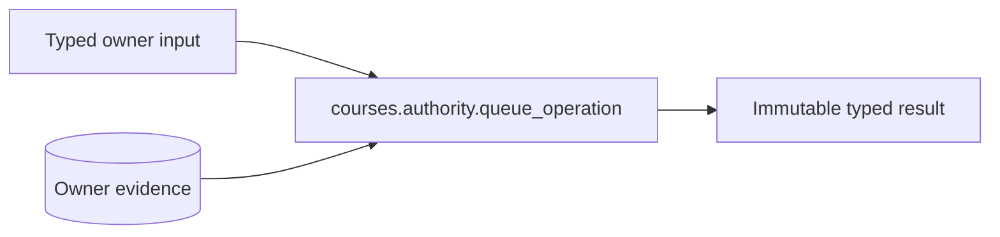

# courses.authority.queue_operation: schematics

```mermaid
flowchart LR
    Input[Typed owner input] --> Capability[courses.authority.queue_operation]
    Capability --> Result[Immutable typed result]
    Evidence[(Owner evidence)] --> Capability
```

The module groups contracts with one lifecycle and dependency direction; it is not a one-class compatibility façade.

- [Overview](index.md)
