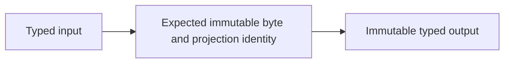

# SearchReferenceAuthorityProjectionReadRequest: schematics

```mermaid
flowchart LR
    Input[Typed input] --> Leaf[Expected immutable byte and projection identity]
    Leaf --> Output[Immutable typed output]
```

The leaf remains path-free and imports from its exact defining module.

- [Overview](index.md)
