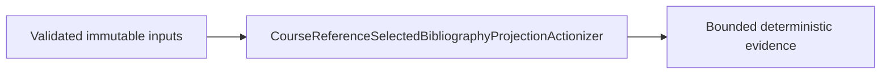

# CourseReferenceSelectedBibliographyProjectionActionizer: schematics

```mermaid
flowchart LR
    Input[Validated immutable inputs] --> Contract[CourseReferenceSelectedBibliographyProjectionActionizer]
    Contract --> Output[Bounded deterministic evidence]
```

The value participates only in the selected-bibliography Request → Actionizer → Result boundary.

- [Overview](index.md)
