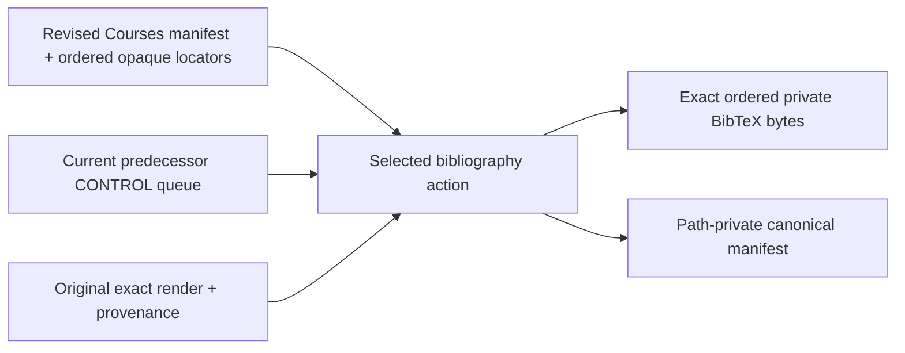

# courses.authority.selected_bibliography: schematics

```mermaid
flowchart LR
    C[Revised Courses manifest + ordered opaque locators] --> A[Selected bibliography action]
    Q[Current predecessor CONTROL queue] --> A
    R[Original exact render + provenance] --> A
    A --> B[Exact ordered private BibTeX bytes]
    A --> M[Path-private canonical manifest]
```

The action is a pure projection. It performs no catalog, filesystem, decision, or compatibility mutation.

- [Overview](index.md)
