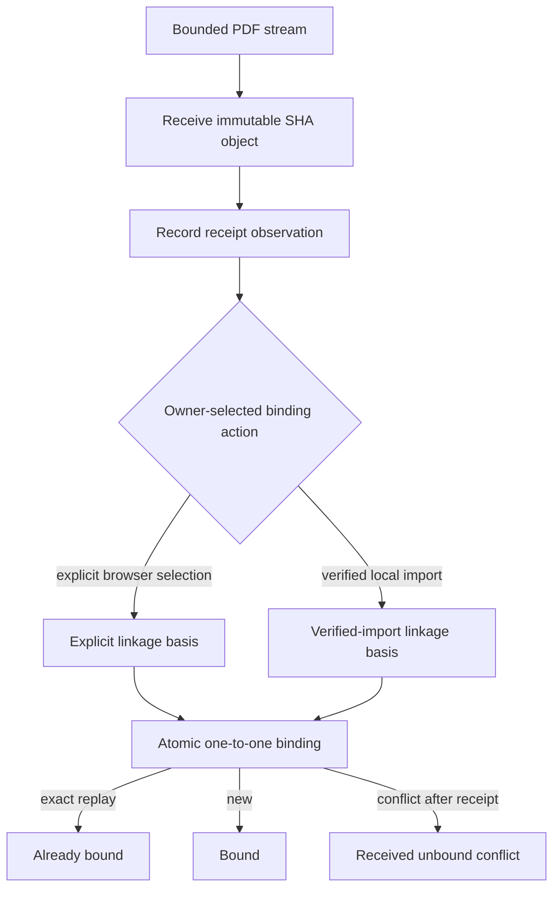

# Document/reference implementation

Immutable data objects inherit the capability's nominal base and retain bounded
validation with their owning models. Narrow repository protocols separate
bibliography, collection, missing-PDF, receipt, and binding behavior. The SQLite
adapter satisfies these ports structurally while the migration remains schema
compatible.

Explicit browser binding always resolves
`explicit-reference-document-selection`; verified local import always resolves
`verified-local-evidence-import`. The basis participates in binding identity.
Exact retries are idempotent and different citekey, digest, or basis occupancy
fails closed.

Receipt precedes binding in composed intake. If custody succeeds and one-to-one
binding conflicts, the result is `received-unbound` and retains the
receipt result rather than representing the request as mutation-free.

No operation changes BibTeX, establishes publication rights, accepts scientific
claims, or admits content to Search.

- [Capability index](index.md)
- [Schematic](schematic.md)
