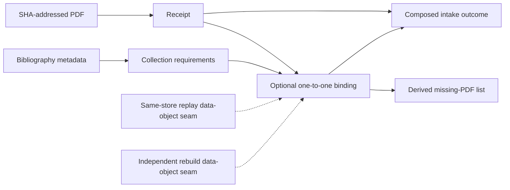

# Document/reference schematic

The replay seams are distinct nominal data-object bases. They define no runner,
request, result, workflow state, or shared replay superclass.

Bindings connect independent document and reference identities. Missing status
is derived and is never persisted as workflow state.

- [Capability index](index.md)
- [Implementation](implementation.md)
