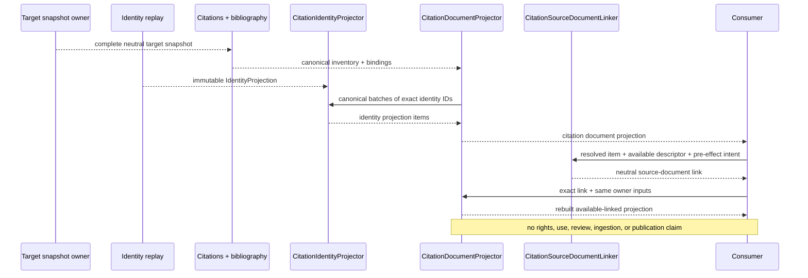

# `projectkoios.references` package implementation

The documented path is deliberately one-way: identity replay establishes
bounded reference identity state, the identity projector exposes safe outcomes,
canonical citation and bibliography packages preserve exact target evidence,
and citation-document control composes those records with identity and document
evidence without changing owner authority.

The References root initializer is unchanged by these slices. Consumers import
citation inventory and bibliography binding from their canonical focused
package facades, identity from its owner, and document control from
`citation_document`. Moved names on the latter are bounded deprecated
identity-preserving attributes; there is no root-facade expansion or duplicate
implementation.

Evidence:

- package source: [`src/python/projectkoios/references`](../../../../src/python/projectkoios/references)
- identity tests: [`test__CitationIdentityProjection.py`](../../../../tests/test__CitationIdentityProjection.py)
- citation document tests: [`test__CitationDocumentProjection.py`](../../../../tests/test__CitationDocumentProjection.py)

- [Package index](index.md)
- [Schematic](schematic.md)
