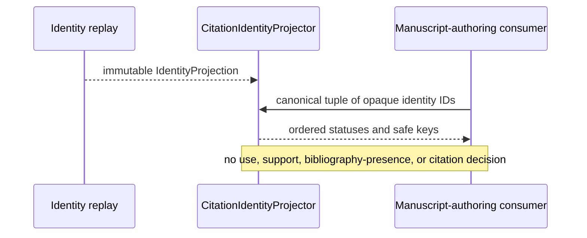

# `projectkoios.references` package implementation

The documented path is deliberately one-way: identity replay establishes
bounded reference identity state, and the citation projector reduces that state
for downstream consumers without changing it.

The package initializer is unchanged by this slice. Consumers import the
projector family from its owning module, avoiding facade expansion and
compatibility aliases.

Evidence:

- package source: [`src/python/projectkoios/references`](../../../../src/python/projectkoios/references)
- focused tests: [`test__CitationIdentityProjection.py`](../../../../tests/test__CitationIdentityProjection.py)

- [Package index](index.md)
- [Schematic](schematic.md)
