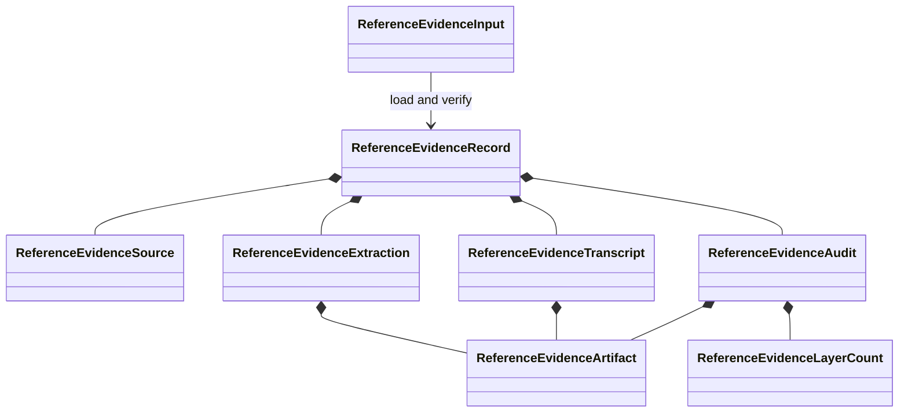

# Ingestion-evidence schematic

```mermaid
classDiagram
    ReferenceEvidenceRecord *-- ReferenceEvidenceSource
    ReferenceEvidenceRecord *-- ReferenceEvidenceExtraction
    ReferenceEvidenceRecord *-- ReferenceEvidenceTranscript
    ReferenceEvidenceRecord *-- ReferenceEvidenceAudit
    ReferenceEvidenceExtraction *-- ReferenceEvidenceArtifact
    ReferenceEvidenceTranscript *-- ReferenceEvidenceArtifact
    ReferenceEvidenceAudit *-- ReferenceEvidenceArtifact
    ReferenceEvidenceAudit *-- ReferenceEvidenceLayerCount
    ReferenceEvidenceInput --> ReferenceEvidenceRecord : load and verify
```

The composition reflects immutable evidence structure. Parsing and loading are
module functions rather than stateless namespace classes.
