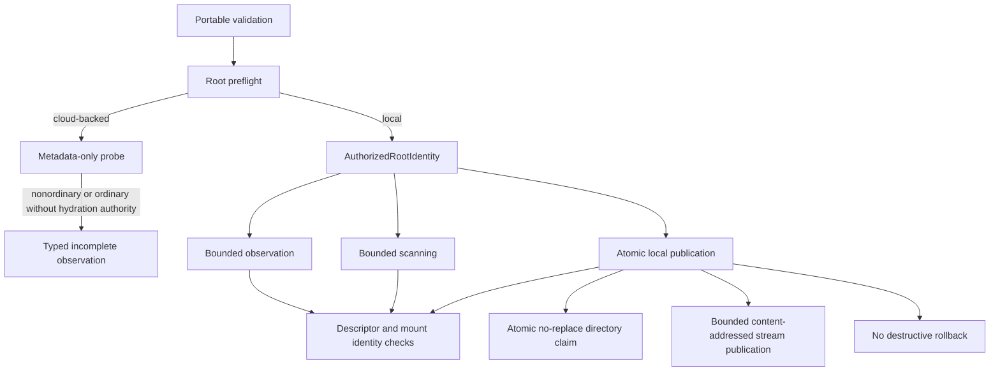

# Path-safety implementation

The package is partitioned by one named responsibility per module:

- `errors.py` owns typed path, boundary, mutation, and limit failures.
- `validation.py` owns literal citation-key and normalized root-relative path grammar.
- `preflight.py` owns immutable storage declarations, probe evidence, candidate classifications, and the provider-neutral probe protocol.
- `probes.py` owns root-preflight authorization and the macOS File Provider metadata probe.
- `inventory.py` owns immutable bounded file and directory observations.
- `platform.py` owns platform descriptor mechanics, atomic no-replace
  directory claims, anonymous staging files, and descriptor-bound no-replace
  file publication.
- `authorization.py` binds directory, device, inode, and mount identities and owns descriptor traversal.
- `observation.py`, `scanning.py`, and `publication.py` own the three focused authorized-root behavior families.
- `root.py` composes those capabilities into `AuthorizedRoot`; it contains no operation implementation.
- `paths.py` preserves intentional explicit-path adapter entry points and labels the metadata-only pathname assertion as deprecated.
- `__init__.py` is an explicit compatibility facade and contains no behavior.

The immutable evidence and inventory records are frozen, slotted
`DataObjectModel` values. Shared implementation behavior belongs to narrowly
named collaborator classes or the authorized-root class family; the package has
no ownerless private module helper functions and no generic contracts module.
Cloud-backed roots remain metadata-only. Local file creation stages bytes in an
anonymous inode and publishes through a descriptor-bound no-replace primitive.
Content-addressed stream publication applies a hard byte cap, hashes while
writing, validates a required prefix and optional size, and re-verifies either
a newly published or deduplicated destination before returning
`AddressedFilePublication`. Linux uses `O_TMPFILE` plus the unprivileged
`/proc/self/fd` `linkat` technique and fails closed without procfs; macOS
requires the staging inode to have zero
links before any content is written and publishes with `fclonefileat`.
Path replacement and automatic destructive rollback are disabled.

- [Module index](index.md)
- [Schematic](schematic.md)
