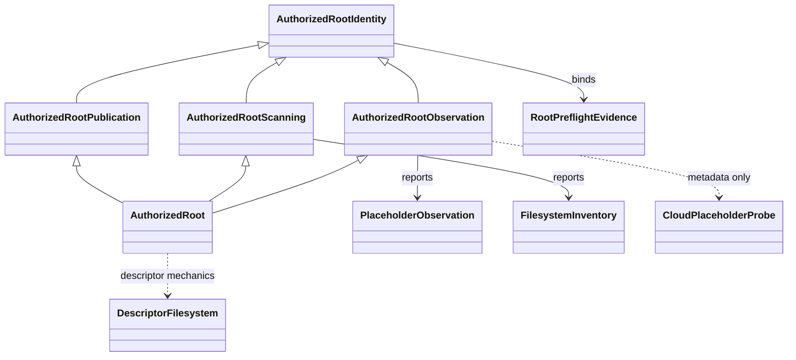

# Path-safety schematic

The composed root remains the supported filesystem capability. Focused base classes express implementation ownership; they are not alternate authority grants or public workflow entry points.

- [Module index](index.md)
- [Implementation](implementation.md)
