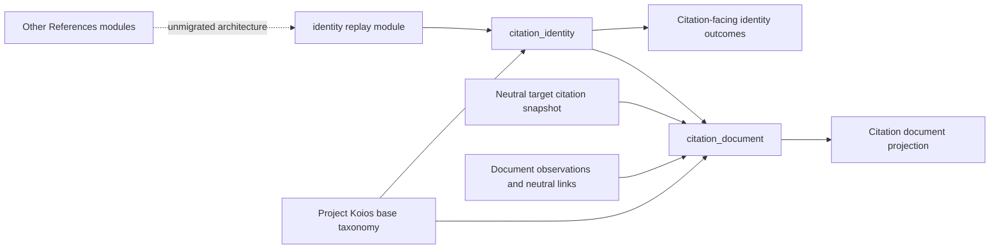

# `projectkoios.references` package schematic

This diagram expands only the modules migrated in the current vertical slices.
Untouched package modules remain opaque.

`citation_identity` reads immutable replay output. `citation_document` composes
that output with owner-supplied target and document evidence. Neither module
introduces identity promotion, rights, review, use, or ingestion authority.

- [Package index](index.md)
- [Implementation](implementation.md)
