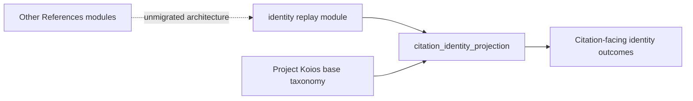

# `projectkoios.references` package schematic

This diagram expands only the module migrated in the current vertical slice.
Untouched package modules remain opaque.

`citation_identity_projection` reads immutable replay output and introduces no
new identity authority or persistence.

- [Package index](index.md)
- [Implementation](implementation.md)
