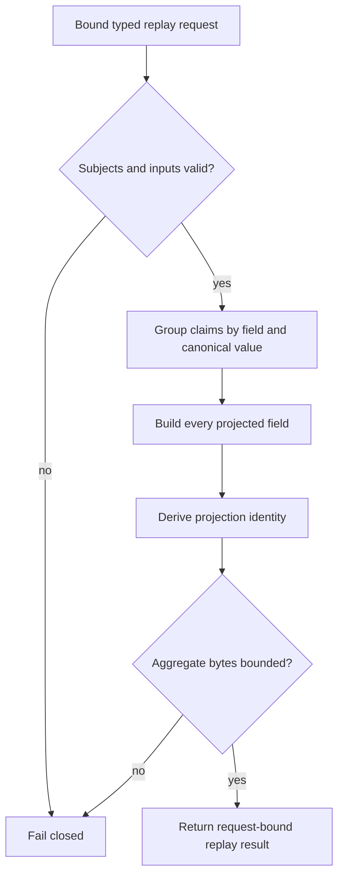

# Reference state replay implementation

The request owns bounded materialization of claim, authoritative-input, and
exclusion iterables. Direct construction requires typed immutable tuples;
`from_iterables` consumes at most one item beyond each configured limit before
failing. Its content-derived `request_id` binds the exact represented intent.

The stateless replayer validates cross-object relationships, sorts and
deduplicates declared inputs and exclusions, retains every distinct value, and
constructs every field in the executable authority matrix. Multiple distinct
values remain an unresolved discrepancy; input order never chooses a winner.

Supporting calculations are private methods on the request, result, or
replayer that owns them. This module has no module-level helper functions,
reflection, service location, persistence, filesystem access, or network
access.

Evidence:

- source: [`state_projection_replay.py`](../../../../../src/python/projectkoios/references/state_projection_replay.py)
- tests: [`test__StateProjection.py`](../../../../../tests/test__StateProjection.py)

- [Module index](index.md)
- [Schematic](schematic.md)
