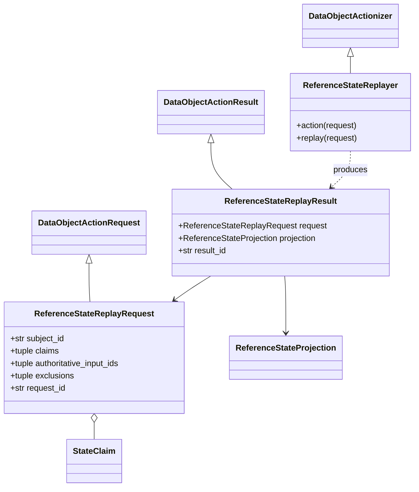

# Reference state replay schematic

```mermaid
classDiagram
    class DataObjectActionRequest
    class DataObjectActionResult
    class DataObjectActionizer
    class StateClaim
    class ReferenceStateProjection
    class ReferenceStateReplayRequest {
        +str subject_id
        +tuple claims
        +tuple authoritative_input_ids
        +tuple exclusions
        +str request_id
    }
    class ReferenceStateReplayResult {
        +ReferenceStateReplayRequest request
        +ReferenceStateProjection projection
        +str result_id
    }
    class ReferenceStateReplayer {
        +action(request)
        +replay(request)
    }
    DataObjectActionRequest <|-- ReferenceStateReplayRequest
    DataObjectActionResult <|-- ReferenceStateReplayResult
    DataObjectActionizer <|-- ReferenceStateReplayer
    ReferenceStateReplayRequest o-- StateClaim
    ReferenceStateReplayResult --> ReferenceStateReplayRequest
    ReferenceStateReplayResult --> ReferenceStateProjection
    ReferenceStateReplayer ..> ReferenceStateReplayResult : produces
```

- [Module index](index.md)
- [Implementation](implementation.md)
