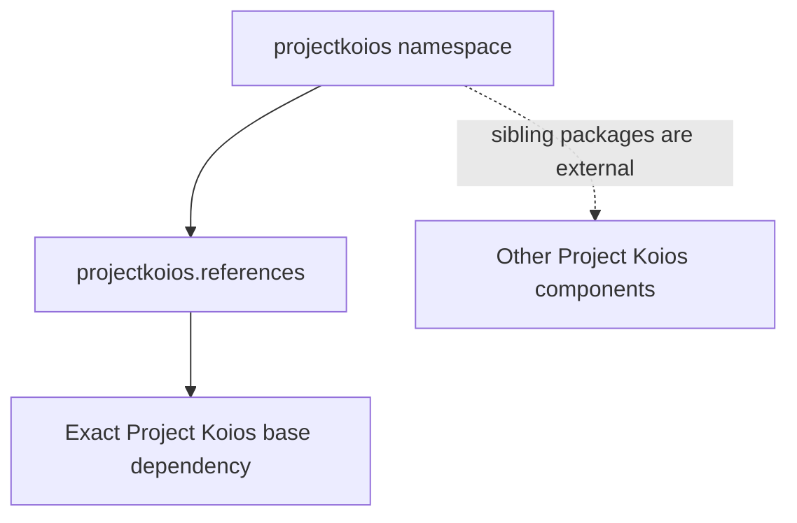

# `projectkoios` namespace schematic

```mermaid
flowchart TD
    N[projectkoios namespace] --> R[projectkoios.references]
    R --> B[Exact Project Koios base dependency]
    N -. sibling packages are external .-> X[Other Project Koios components]
```

The diagram expands only the namespace content implemented in this repository.

- [Namespace index](index.md)
- [Implementation](implementation.md)
